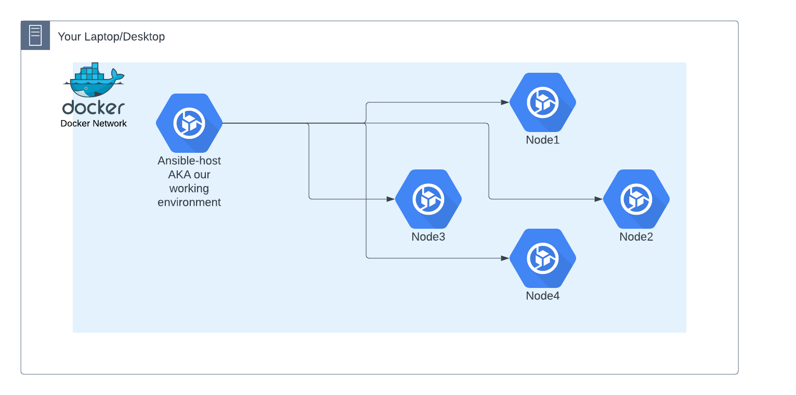

---

# Ansible Environment Setup


.footer: Created By Alex M. Schapelle, VAioLabs.io

---

# Ansible Environment Setup 


As mentioned, we will be working on our virtual labs with `docker` and `docker-compose`, thus docker installation is required.
- What do we need ?
  - Unix/Linux Node
  - Docker environment installed
  - Text editor: I'll be using `vim`, yet your are welcome to use anything you wish and are comfortable with.

- To install `docker` and `docker compose` run on most well known (Debian,Ubuntu,Fedora,Rocky,Arch,Gentoo...) Linux distributions we will use the next command: 

```sh
curl -L get.docker.com| sudo bash
# it is good practice to add your user to docker group to verify that there won't be any permission issues
sudo usermod -aG docker ${USER}
# although the permissions are given, they are not loaded till new session is at hand, so we reload the session
sudo su ${USER}
```
  - In case you are using RedHat based Linux distro, like Fedora, Rocky and Alma, the above command should work in same manner.
  - With RedHat itself, it will require you to use license which you need to purchase
  - While with Windows, Please install Docker-Desktop.
  - In case of MacOS, Docker-Desktop is the solution at the moment, yet it changes rapidly, thus do ask instructor on the matter.

> `[!]` Note: I, myself am using Linux distribution, in case you use something else, there should not be too much of the difference, yet that is the price of learning: adaptation to the unknown.

> `[!]` Note: You should try to use docker project from the course repository under folder named `99_misc/setup/docker` or from [gitlab repository here](https://gitlab.com/silent-mobius/ansible-compose.git)

---

# Ansible Environment Setup (cont.)

From here on we'll be using docker as a base of our virtual environment to test `ansible` command, configuration files, modules and so on.
In case you still do NOT have the gitlab repository mentioned above in note, and you do NOT have repository of this pdf as well, then you should try to get the project from [gitlab repository here](https://gitlab.com/silent-mobius/ansible-compose.git). In any other case, please follow the instructions below.


#### The Playground

The lab itself consist of `ansible-host` container, where we will be practicing, running, testing and validating our ansible configurations. All the code management, version control and code will be done on this very container, and the files saved will be outputted on your pc/laptop/environment under folder `99_misc/setup/docker/ansible`.
Additionally we will have four more containers, of `debian` and `rockylinux`, that will appear as vm's or remotely connected web/database/application servers, as you have in most of the environments in different organizations.
The main idea behind this containerized playground is to provide as with practice environment that is able to look like deployment platform, for us to practice and implement various parts of `ansible`.
The playground is reproducible so you may practice on your own when even you wish.

----

# Ansible Environment Setup (cont.)

#### Are There Any Other Places To Practice `ansible` ?

Yes - As mentioned, `ansible` was purchased by RedHat in 2015 and they can provide you with practice labs for their certifications, as well as other companies and self-employed instructors that teach the same course, via udemy, kodekloud, katakode, diveinto and so on ...

The main goal it to practice, and although theories are fine, but with no hands-on practice, in most of the cases, theories fly away like birds in winter...


---

# Staring The Lab

Back to the topic of setting up the local lab based on `docker` and `docker compose`. Here are initial step required to start the lab with some explanations :

- In case you do not have the required project files, clone the [repo](https://gitlab.com/silent-mobius/ansible-compose.git) to your working directory.
    - If you have the pdf project with you, then skip this step
- Move into project directory
    - If you have pdf project move into `99_misc/setup/docker`
- Initialize `docker compose` to start the process of building the lab
    - By the end you should have 5 running containers with ansible-host and nodes 1-4 up and running. 
- Last  but not least, we log into `ansible-host` to start our learning process
    - We will be logged inside `ansible-host container`, with user named `ansible`, and most of tools already provided in there

```sh
sudo apt update && sudo apt install git -y

git clone https://gitlab.com/vaiolabs-io/ansible-shallow-dive.git

curl -L get.docker.com | sudo bash 

sudo usermod -aG docker admin

sudo su - admin

docker version

cd ansible-shallow-dive/99_misc/setup/docker/

docker compose up -d
```

---

# How Ansible Works

#### Architecture  Description

The design goals of Ansible include:

- __Minimal in nature__: Management systems should not impose additional dependencies on the environment.
    - That said if you are implementing Ansible from the beginning, it requires ssh/ssh-keys
- __Consistent__: With Ansible one should be able to create consistent environments.
- __Secure__: Ansible does not deploy agents to nodes. Only OpenSSH and Python are required on the managed nodes.
- __Reliable__: When carefully written, an Ansible playbook can be idempotent, to prevent unexpected side-effects on the managed systems. It is possible to write playbooks that are not idempotent.
- __Minimal learning required__: Playbooks use an easy and descriptive language based on YAML and Jinja templates.

---

# Architecture  Description (cont.)

Generally the Ansible architecture should be structures in a manner of remote machine or container that takes your ansible command/script/playbooks/roles/templates/anything IaC related, and with remote connection executes the task it was requested to do. Usually one illustration is far better then thousand words, thus lets have a look:



To describe in bullet points:

- There are several server/computers/vms/containers/anything with ssh connections available.
- There is an `ansible host`:
    - `ansible` is invoked with manual trigger,either with `ansible` command or `ansible-playbook` 
        - Remote applications are also capable to invoke it (CI/CD tools)
    - `ansible` will read the inventory provided or will get inventory dynamically
    - `ansible` should start running the tasks it was requested to run

---

# Architecture  Description (cont.)

But in order to make it work, we'll need existing software packages, modules and configuration files to work on.
When we issue `ansible --version` command it will provide us with information about ansible referencing the configuration files.

```sh
ansible --version
ansible [core 2.14.3]
  config file = None
  configured module search path = ['/home/aschapelle/.ansible/plugins/modules', '/usr/share/ansible/plugins/modules']
  ansible python module location = /usr/lib/python3/dist-packages/ansible
  ansible collection location = /home/aschapelle/.ansible/collections:/usr/share/ansible/collections
  executable location = /usr/bin/ansible
  python version = 3.11.2
```
> `[!]` Note: `config file = None` that is reference to main ansible configuration is set to `None`, thus it gives us possibility to learn to build the file from scratch.

---

# Ansible Configuration File

We initially suggested that there are no default config files with Ansible, yet Ansible still requires to have one. Ansible seeks that file in various places with multiple locations based on the installation method, and the search has precedence within our working system.
The locations ansible will search for config file from the highest to lowest precedence are:
<!-- Show example from 4 to 1 -->
1. `ANSIBLE_CONFIG`: Environment variable with filename 
2. `./ansible.cfg`: An Ansible config file in current directory
3. `~/.ansible.cfg`: Hidden file in your users home directory.
4. `/etc/ansible/ansible.cfg`: Typically provided, through package manager of our system.

- This course works on files as if they were `Infra-As-a-Code` or `IaC`, thus the most usable way for us to use `git` with Ansible config file would be option 2.
- Ansible seeks for default config file in your shells current location
  - That's why we'll need to create local config file named `ansible.cfg`
- If Ansible won't find the local `ansible.cfg` file , it will not work so,


---

# Practice

- Create `/etc/ansible/` folder and int add `ansible.cfg`
- Run `ansible --version` and check `config_file` value
- Create `~/.ansible.cfg` 
- Run `ansible --version` and check `config_file` value
- Create folder test, `cd` into it and create `ansible.cfg`
- Run `ansible --version` and check `config_file` value
- Run `ANSIBLE_CONFIG=/tmp/ansible.cfg ansible --version` and check `config_file` value

---

# Inventories


Lets take a look on inventories, their types and uses on different types of Linux hosts, inventory variables, ranges, groups and group children 
However, before diving into these, One thing we must always consider. to work with our tools at hand: As mentioned, Ansible has several configuration files, and all these need to be maintained, updates, developed and saved on remote place.
In this course we'll be using `git` version control and `gitlab` remote server to work on the contents of Ansible files. As such the student working on their own device, will need to install git client on their working device and also create/use `gitlab/github/any remote git based repository` to follow the course.

---

# Inventories (cont.)

In order to start, well work in structured manner, of creating designated folders with chapter naming and under each chapter we'll practice subject at hand.
This chapter follows `setup` topic thus we should create folder named in the same manner in continue by using sub-folder for each sub-topic.E.g.

```sh
mkdir -p 01_setup/01_inventories
cd 01_inventories
touch ansible.cfg
ansible --version
    ansible [core 2.14.3]
        config file = /home/aschapelle/00_ansible_cfg/ansible.cfg # required for ansible configuration
        configured module search path = ['/home/aschapelle/.ansible/plugins/modules', '/usr/share/ansible/plugins/modules']
        ansible python module location = /usr/lib/python3/dist-packages/ansible
        ansible collection location = /home/aschapelle/.ansible/collections:/usr/share/ansible/collections
        executable location = /usr/bin/ansible
        python version = 3.11.2 (main, Mar 13 2023, 12:18:29) [GCC 12.2.0] (/usr/bin/python3)
echo '[defaults]' >> ansible.cfg
echo 'inventory=./hosts.ini' >> ansible.cfg
ansible --version
```

---

# Inventories (cont.)

### Static Inventories

Inventory file and its structure is crucial for Ansible. You can create your inventory file in one of many formats, depending on the inventory plugins you have. The most common formats are `INI` or `YAML`

- Inventory file is suggested either with `-i` option or with `ansible.cfg` configuration line specifying the location of the file.
    - Usually looks like this: `inventory = my_inv_file` or any other name
- An `.ini` file is a configuration file for computer software that consists of a text-based content with a structure and syntax comprising **key–value** pairs for properties, and sections that organize the properties
    - You can read about [`ini` in the link](https://en.wikipedia.org/wiki/INI_file), but it is pretty self explanatory, thus do not dwell on it too much.
- The inventory file can also be written in `yaml` format, with `.yml` extension, yet it is not mandatory.

---


# Inventories (cont.)

### Static Inventories

The structure can be provided as follows:

- defaults :Even if you do not define any groups in your inventory file, Ansible creates two default groups:
    - `[all]` : group contains every host
    - `[ungrouped]` : all hosts that don’t have another group aside from all

> `[!]` Note: Every host will always belong to at least 2 groups: `all` and `ungrouped` or `all` and some other group

- `[groups]`: Any name in square brackets is considered as custom group
    - Any hostname or ip address, under group name will be considered as part of a group
    - Each host can be in several groups at the same time.
    - Groups can have parent/child relationships.Parent groups are also known as nested groups or groups of groups.
        - To create parent/child relationships for groups in INI format, use the `:children` suffix

---

# What Now ?

- We'll setup our configuration and local inventory files that will manage our nodes
    - In virtual labs, there is no need to install Ansible, because it is installed already
    - We can install Ansible from `pip3` to use the latest version.
        - In python3.11 `pipx` is the tool required to do so and it also requires virtual-environments either with `venv`, `pipenv` or `poetry`
- Also we'll connect to all virtual nodes (containers)
- In addition, we will create version control to  manage our changes
- Finally we'll start using Ansible command line utility to learn its capabilities

In other words: lets go and practice

---

# Practice

- **Before starting the lab verify that you have empty repository for version control on gitlab or github. I recommend the first, yet you are free to use which ever you want to, as long as you will be able to debug your own issues that are not part of the course scope**
    - Suggested name for repository: `Ansible-Shallow-Dive`
- Log in to Ansible host container with : 
    - `docker compose exec -it ansible-host /bin/bash`
    - You'll be logged as user `ansible`, some what production level environment setup, which we will discuss later on.
- Verify that ansible is installed
- Create automation folder `01_ansible_inventory`
- Generate empty `ansible.cfg` `hosts.ini` `README.md` and `.gitignore` files
- Setup version control and save it to remote repository
- Edit gitignore not to save `*.swp` files
- Edit `ansible.cfg` with the text `[defaults]` and under it `inventory=hosts.ini`: we'll explain it later
- Edit `hosts.ini` file
  - Write down all the hosts names line by line from `node1` to `node4`
  - Issue an `ansible --list-host all`
    - If there is suitable output of all the nodes, You are done, else, check with the instructor


---

# Practice (cont.)

```sh
# Just in case you have not logged into ansible-host container
docker compose exec -it ansible-host /bin/bash
which ansible
ansible --version
mkdir 01_ansible_inventory && cd 01_ansible_inventory
touch README.md .gitignore ansible.cfg hosts.ini
git init 
git config user.name silent-mobius
git config user.mail alex@vaiolabs.com
echo '*.swp' > .gitignore
git add .
git commit -m "initial commit to repo"
git remote add {YOUR_REMOTE_GITLAB_REPO_WHICH_YOU_SHOULD_HAVE_CREATED}
git push -U origin master

```
---

# Practice (cont.)

```sh
vi ansible.cfg
    [defaults]
    inventory = hosts.ini
```

```sh
vi hosts.init
    node1
    node2
    node3
    node4
```

```sh
git add *
git commit -m "saving initial changes"
git push
ansible --list-hosts all
```


---

# Hosts and Groups Variables

The `hosts.ini` file enables us to create structured **key value** pairs, that eventually will be targets onto which we would execute remote commands.
In previous practice we did setup up groups but did not emphasized the explanations, thus lets address that:
Lets go back to the lab in docker-compose and edit additional configurations that we'll need.
```sh
# in case you did not login
docker compose exec -it ansible-host /bin/bash 
cd 01_ansible_inventory
```

We already have initial building blocks, in shape of `ansible.cfg` and `hosts.ini` files, so all we need is to update files as we learn more and more. In order to keep the files in an usable manner, I suggest to use git branches and keep each chapter outline and practice in different branches. Before we start updating config files, let us start by testing connectivity with the nodes:

- Lets check connectivity between `ansible-host` and nodes 1 to 4. 
    - Keep in mind that dns resolution is provided by `docker-compose`, so at the moment, there is no need to know IP addresses.
```sh
ping -c 1 node1
ping -c 1 node2
ping -c 1 node3
ping -c 1 node4
```
- Now, let's configure default inventory file inside our `ansible.cfg` config file and use to test same connection: 
- Notice that we have created `ansible.cfg` and added `defaults` entry, which provides default configuration to ansible to feed on.
- First configuration under defaults is location of `inventory` file, that can be a file with absolute or relative paths.

```sh
vi ansible.cfg
    [defaults]
    inventory = hosts.ini
```
- In previous practice, we wrote our nodes addresses by their hostnames in `hosts.ini` file.
    - As mentioned, by default all the nodes that are not written to any group are part of `group [all]`
- When running systems it is good idea to separate them in to logical groups, so we should regroup the content in `hosts.ini`
  
```sh
vi hosts.ini
    [web]
    node2
    node4
    [db]
    node1
    node3
    [multi:children]
    web
    db
```
> `[!]` Note: for purposes of the exercise these nodes do not exists. We are just providing examples of possible environments.

Lets check what we have:

```sh
ansible --list-hosts web
ansible --list-hosts db
ansible --list-hosts all
```
---

# Hosts, Groups and Variables (cont.)

When using Ansible, it will try to connect via ssh service, which in return requires digital fingerprint writing to `known_hosts` as well as ssh certificates, private and public.
The issue with digital fingerprints, are that in some cases we just want to check connectivity and to by pass that we can use custom Ansible environment variables as in any other UNIX/Linux command.

```sh
ANSIBLE_HOST_KEY_CHECKING=False  ansible  all -m ping
```

While it is somewhat convenient to use environment variables, it is always useful to set these setting in to configuration files. In this case almost all environment variables can be set into `ansible.cfg` file. 

```sh
vi ansible.cfg
```
```ini
[defaults]
inventory = hosts.ini
host_key_checking = False
```

---

# Hosts, Groups and Variables (cont.)

Each host in the `ini` file can have itself configured with Ansible variables for different purposes:
- `ansible_user`: The user name to use when connecting to the host
- `ansible_host`: The name of the host to connect to, if different from the alias you wish to give to it.
- `ansible_password`: The password to use to authenticate to the host (never store this variable in plain text)
- `ansible_ssh_private_key_file`: Private key file used by ssh. Useful if using multiple keys and you don’t want to use SSH agent
- `ansible_become`: Equivalent to `ansible_sudo` or `ansible_su`, allows to force privilege escalation
- `ansible_become_method`: Allows to set privilege escalation method
- `ansible_become_password`: Equivalent to ansible_sudo_password or ansible_su_password, allows you to set the privilege escalation password

Are there more variables? yes, definitely but, we'll NOT gonna cover it all.

```sh
vi hosts.ini
```
```ini
[all]
node1 ansible_user=user ansible_password=docker
```

---

# Hosts, Groups and Variables (cont.)

Let's test our configuration with modules. We'll cover them later in depth, but for now let's use `ping` and `command` modules.
```sh
ansible all -m ping -o
ansible all -m command -a 'id' -o
```
When using `ping` module, we should get json output, with value `pong`. If no value comes or there are errors, it means something is wrong and we must fix it.
When using `command`, we are asking Ansible to run a `specific command` on remote hosts. The `specific command` is passed as an argument to `command` module. If we get output of the command passed as an argument, then it worked, yet if we did not get the command output, we need to fix the configuration.

---

# Practice

- Add to existing node1 and node3 user `root` and password `docker`
- Test connection with command `id` and verify that user providing the answer is `root`

```ini
[db]
node1   ansible_user=root   ansible_password=docker
node3   ansible_user=root   ansible_password=docker
```
```sh
ansible all -m command -a 'id' -o
```
---

# Hosts, Groups and Variables (cont.)

As seen in our first example, we can chain groups of hosts and also we can chain group of groups as `children` groups. In previous we saw that we can add to each host its own Ansible variable, but one must agree that there should be better way to do so, we can setup group variables.

```ini
[multi:children]
web
db

[multi:vars]
ansible_user = root
ansible_password = docker
```
---

# Practice

- Remove db group nodes variables
- Add to existing inventory multi-group variables of `ansible_user` and `ansible_ssh_private_key`
- Test the variables with `id` command.
    - If there are any errors, act accordingly to fix them.

```ini
[multi:vars]
ansible_user = root
ansible_ssh_private_key_file = ./id_rsa
```

```sh
chmod 600 id_rsa
ansible all -m command -a 'id' -o
```


---

# Dynamic Inventories

Mostly can be implemented where there is API for managing vm's
- Cloud
- Virtual environment

Why do we need `Dynamic Inventory`, if you already have `Static Inventory` ?

#### And

If `Dynamic Inventory` exists , What's the point in having `Static Inventory` ?

Dynamic inventories are implemented mainly in environments where 3rd party application can `feed` Ansible with data regarding to hosts on the network. Most of these are `cloud` environments, yet there are custom made applications with `api`, such as cobbler, openstack and so on, that can serve as host inventory provider in closed networks. One may find an [example](https://github.com/lukaspustina/dynamic-inventory-for-ansible-with-openstack/blob/master/openstack_inventory.py) here. 

Also we can find [official documentation](https://docs.ansible.com/ansible/latest/dev_guide/developing_inventory.html) helping developing scripts , mostly python based, for dynamic inventory generation.

  <!-- - test connection with `ping` module to verify the connection -->

> `[!]` Note: We'll talk about Dynamic inventories later during the course.


