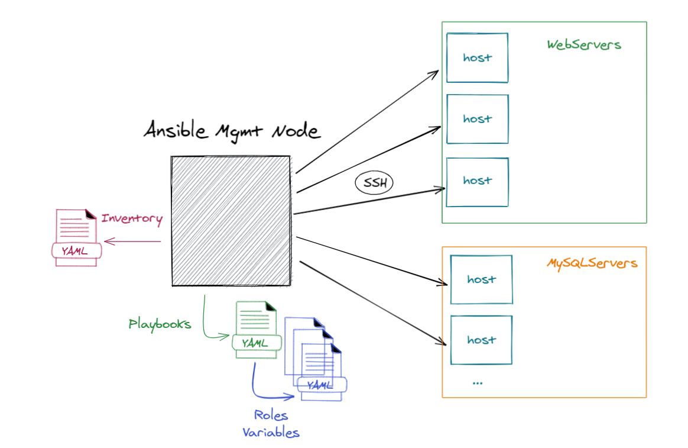

---

# Ansible Playbooks


---

# Before we begin

Few things that we need to have general understanding:

- Python is interpreted dynamic programming language
- Any programming language utilizes data-types, variables, conditions, loops, data-structures, classes, objects and Python is not an exception
    - Unique feature of python is indentation
    - Due to YAML being developed  with Python, it inherits those treats
    - Python can read/write/pass data, mainly values from YAML to YAML 
- Ansible was developed with Python programming language
    - It also inherits Python features 
    - YET, to simplify it adds its own keyword implementation variables, conditions, loops, block, roles and modules
        - Yes - you can develop modules in Python
- For us to continue, we only need to remember that data-type mostly used with any programming language is string and integer.

---

# YAML: Yet Another Markup Language

Applications and software in general, moves information by sharing its own data with each other apps, in a type of a format that is predefined and acknowledge by all applications.
For example in web applications most beloved and used format is `json`. Although `json` syntax in many cases can be confusing, and hard to read.

#### YAML to the rescue

- YAML is as human readable, data-serialization language.
- Easy to use, easy to read and easy to collaborate with as well.
- Reading and writing of YAML format is support in most major programming languages
- YAML files are often described with `.yaml` or `.yml` extensions.
    - `.yaml` is the officially recommended extension since 2006, yet in case you work with *nix based system, it does not matter

---

# YAML: Yet Another Markup Language (cont.)

#### YAML to the rescue

- YAML consists of key/value pair collections also known as `dictionaries`
    - Keys need to be unique
    - Values can be the same
    - Keys and values are separated with colon (:)
        - Everything after colon is treated as _string_
        - In some cases, solely numbers are treated as _integers_
            - Unless they are between single or double quotes -> then they are _strings_
    - `dictionaries` or `dicts` for short, are storing data structures inside programming languages
        - When we indent in YAML - we start new `dict`
    - There are also `list`, which also stores data, yet it uses only values, without key
        - Usually there is a key that defines collection of list


---

# Examples

- [validate script](../03_playbooks/00_examples/validate.sh)
- [init](../03_playbooks/00_examples/00_init.yaml)
- [keys/values](../03_playbooks/00_examples/01_key_value.yaml)
- [keys/values with integers](../03_playbooks/00_examples/02_key_value_int.yaml)
- [keys/value with quotes](../03_playbooks/00_examples/03_key_value_quote.yaml)
- [key/value as multiline](../03_playbooks/00_examples/04_key_multi_line.yaml)
- [key/value as singleline](../03_playbooks/00_examples/05_key_multi_as_singleline.yaml)
- [keys/values with boolean](../03_playbooks/00_examples/06_key_with_bool_value.yaml)
- [values list ](../03_playbooks/00_examples/07_list_values.yaml)
- [invalid syntax](../03_playbooks/00_examples/08_invalid_example.yaml)
- [indented key with keys/values](../03_playbooks/00_examples/09_indented_key_with_keys_values.yaml)
- [key with list values](../03_playbooks/00_examples/10_key_with_list_value.yaml)
- [indent key with key list values](../03_playbooks/00_examples/11_indent_key_with_key_list_values.yaml)

---

# Practice

- Use test shell script in [Project](../03_playbooks/validation.sh) to validate YAML that we  will create.
- Create file called test.yaml with appropriate start and end markers, run the test script -> the output should be NONE
- Create a list of car manufacturers, it should include brands below, yet you are welcome to add:
    - Acura
    - Mazda
    - Honda
- Change each of these entries in the list, so they are dictionaries
- Add as key/values to each car manufacturers, when they were founded and what is their web-site
- Add a key of `founded_by`, but with a list of the founder or founders

---

# Practice (cont.)

```yaml
Acura:
  year_founded: 1986
  website: acura.com
  fonded_by:
    - Soichiro Honda 
Mazda:
  year_founded: 1920
  website: mazda.com
  fonded_by:
    - Jujiro Matsuda
Nissan:
  year_founded: 1933
  website: nissan-global.com
  fonded_by:
    - Masujiro Hashimoto

```

---

# How YAML is used with Ansible ?

As we saw from examples, YAML is a structured data, that is passed to ansible modules. Those modules pass it to predefined python scripts. these scripts are copied to target machines, and executed with the values passed from YAML



---

# Ansible Playbook/YAML Structure


#### How ansible sees YAML

- Hosts: lists of target hosts that we'll run playbooks on
- Vars: variables that apply to the play on all target systems
- Tasks: list of tasks that will be executed  within play, including pre and post tasks
- Handlers: list of handlers (notification tasks) that are executed with `notify` keyword from `tasks`
- Roles: list of roles (dedicated tasks ) to be imported  into the play

---

# Ansible Playbook/YAML Structure (cont.)

In side the YAML it would look like this: 

```yaml
# Every YAML file should start with three dashes 
---

# The  minus in YAML this indicates a list item. the playbook contains a list of plays,
# with each play being a dictionary
-
  # Hosts: lists of target hosts that we'll run playbooks on
  # Vars: variables that apply to the play on all target systems
  # Tasks: list of tasks that will be executed  within play, including pre and post tasks
  # Handlers: list of handlers (notification tasks) that are executed with `notify` keyword from `tasks`
  # Roles: list of roles (dedicated tasks ) to be imported  into the play
  # Note: not all are required to be used in single playbook
# Every YAML file file should end with three dots
...
```

Each line would represent the configuration that we would use in combination of a module/s that we would use to execute.
> `[!]` Note: we'd also need to use our `ansible.cfg` and `hosts.ini` to make it work

---

# Ansible Playbook/YAML Structure (cont.)

#### Example of setup

```sh
mkdir -p 03_playbooks/00_init_setup
touch ansible.cfg hosts.ini motd_playbook.yaml db_motd

echo 'This is MOTD file for DB servers - Deployed by ansible' > db_motd

echo '[defaults]' > ansible.cfg
echo 'inventory=hosts.ini' >> ansible.cfg
```
Then we edit the motd_playbook.yaml
> `[!]` Note: `hosts.ini` file should be the same as we have set before, thus no point showing how to copy paste it.

---

# Ansible Playbook/YAML Structure (cont.)

#### Example of setup (cont.)

```yaml
---

# The  minus in YAML this indicates a list item. the playbook contains a list of plays,
# with each play being a dictionary
-
  # Hosts: lists of target hosts that we'll run playbooks on
  hosts: db
  user: root

  # Vars: variables that apply to the play on all target systems
  # Tasks: list of tasks that will be executed  within play, including pre and post tasks

  tasks:
    - name: Configure a MOTD (Message Of The Way) on DB server
      copy:
        src: db_motd
        dest: /etc/motd
  # Handlers: list of handlers (notification tasks) that are executed with `notify` keyword from `tasks`
  # Roles: list of roles (dedicated tasks ) to be imported  into the play
  # Note: not all are required to be used in single playbook
# Every YAML file file should end with three dots
...

```

To execute the playbook with `ansible-playbook` command with the name of playbook

```sh
ansible-playbook motd_playbook.yaml
```

---

# Practice

- Create folders 03_Playbooks/00_init and `cd` into it:
  - Setup `hosts` file and `ansible.cfg` files appropriately
  - Create initial playbook called **playbook-ping.yaml**
    - In playbooks create a task that pings all possible hosts
    - [RTFM](https://docs.ansible.com/ansible/latest/collections/ansible/builtin/ping_module.html)
- Go back to 03_playbooks and create new folder 01_playbook_copy and `cd` into it:
    - Verify that you have `hosts` and `ansible.cfg`
    - Create file db_motd with message : `Welcome to DB server- deployed by ansible`
    - Create a plabook called **playbook-copy.yaml**
        - use user root to perform the task
        - Copy the db_motd file to `/etc/motd`  on all db targets
        - [RTFM](https://docs.ansible.com/ansible/latest/collections/ansible/builtin/copy_module.html)

---

# Practice (cont.)

```yaml

---
- hosts: all
  tasks:
    - name: ping all nodes
      ping:

...
---
hosts: db
user: root
tasks:
  - name: Copy MOTD 
    copy:
      src: db_motd
      dest: /etc/motd
...
```
---

# Ansible Playbook/YAML Structure (cont.)

#### Variables use in playbooks

In some of the playbooks we;ll be able to configure and setup static values to be used during the playbook. This concepts is called `variable` use.
We create new section in out playbook called `vars` and under its indentation we add a _key_ word which is variable name and  with a _string value_ which is variable value.
Later on we can summon the value by using double curly braces with double quotes: `"{{ variable_name }}"`

Variable playbook example:

```yaml
---
-
  hosts: db
  user: root

  # Vars: variables that apply to the play on all target systems
  vars:
    motd: 'Welcome to DB server - Deployed By Ansible '
  tasks:
    - name: Configure a MOTD (Message Of The Way) on DB server
      copy:
        content: "{{ motd }}"
        dest: /etc/motd
```

---


# Ansible Playbook/YAML Structure (cont.)

#### Variables use in playbooks

One additional features with Variables in playbooks is that, they can also be passed externally with `-e` or `--extra-vars` option to `ansible-playbook` command 

```sh
ansible-playbook motd_playbook.yaml -e 'motd="This is a TEST motd output"'
```

---

# Practice

- Go back to 03_playbooks and create new folder 02_playbook_copy_vars and `cd` into it:
    - Verify that you have `hosts` and `ansible.cfg`
    - Copy **playbook-copy.yaml** to this folder and edit the **vars** section in playbook:
        - Add variable `motd` with value of `Welcome to DB server- deployed by ansible`
        - Verify that you are **NOT** copying the `db_motd` file
            - Inserted use `content` key in `copy` module and place `"{{ motd }}"` variable
        - Use user root to perform the task
        - Run playbook on all db targets
        - Test the MOTD on remote DB node that it has indeed changed
        - Pass extra variable to playbook with content of `This is TEST motd`
        - Test the MOTD on remote DB node.
        - [RTFM](https://docs.ansible.com/ansible/latest/collections/ansible/builtin/copy_module.html)

---

# Practice (cont.)

```yaml
---
-
  hosts: db
  user: docker

  vars:
    motd: "Welcome to DB Server - Deployed by Ansible"
  tasks:
    - name: Configure a MOTD (Message Of The Way) on DB server
      copy:
        content: "{{ motd }}"
        dest: /etc/motd
      become: True
...
```

```sh
ansible-playbook motd_playbook.yaml
ansible-playbook motd_playbook.yaml -e 'motd="This is TEST motd"'
```
---


# Ansible Playbook/YAML Structure (cont.)

#### Expanding on target section

If have not noticed, when running with Ansible, each time a setup module, aka fact gathering task, is run automatically. It gets values from targets to be used later in playbook.
The setup module use in many cases adds over head which might not be useful in cases when remote ansible variables are not required.
Thus this can be configured either to filter the required values or to disable all at once.


```yaml
---
-
  hosts: db
  user: root
  gather_facts: False
  vars:
    motd: 'Welcome to DB server - Deployed By Ansible '
  tasks:
    - name: Configure a MOTD (Message Of The Way) on DB server
      copy:
        content: "{{ motd }}"
        dest: /etc/motd

```

---

# Ansible Playbook/YAML Structure (cont.)

#### Handlers

Sometimes you want a task to run only when a change is made on a machine. For example, you may want to restart a service if a task updates the configuration of that service, but not if the configuration is unchanged. Ansible uses handlers to address this use case. Handlers are tasks that only run when notified.

Tasks can instruct one or more handlers to execute using the `notify` keyword. Handlers must be named in order for tasks to be able to notify them using the notify keyword.

Alternatively, handlers can utilize the `listen` keyword. Using this handler keyword, handlers can `listen` on topics that can group multiple handlers.

```yaml
---
-
  hosts: db
  user: root
  gather_facts: False

  vars:
    motd: 'Welcome to DB server - Deployed By Ansible '
  tasks:
    - name: Configure a MOTD (Message Of The Way) on DB server
      copy:
        content: "{{ motd }}"
        dest: /etc/motd
      notify: Configure of MOTD  

  # Handlers: list of handlers (notification tasks) that are executed with `notify` keyword from `tasks`
  handlers:
    - name: Configure of MOTD 
      debug:
        msg: The MOTD was changed

```

---

# Practice 

- Go back to 03_playbooks and create new folder 03_playbook_copy_handlers and `cd` into it:
    - Verify that you have `hosts` and `ansible.cfg`
    - Create **playbook_copy_handlers.yaml** in this folder and add the **handlers** section in playbook:
        - Create task with file module that will remove the /etc/motd file from target hosts
        - Verify that you are not using fact gathering (aka setup module)
        - Add handler with debug module that provides output message when task succeeds
        - [RTFM](https://docs.ansible.com/ansible/latest/collections/ansible/builtin/file_module.html)
---

# Practice (cont.)

```yaml

---
-
  hosts: db
  user: root
  gather_facts: False
  vars:
    motd: 'Welcome to DB server - Deployed By Ansible '
  tasks:
    - name: Remove MOTD file
      file:
        path: /etc/motd
        state: absent
      notify: Remove MOTD file

  handlers:
    - name: Remove MOTD file
      debug:
        msg: MOTD file was removed

```

---

# Ansible Playbook/YAML Structure (cont.)

#### Conditions

When we mentioned `setup` module, we explained that it gathers information about the remote targets. Following that, we can make decisions based on those information facts.
The simplest conditional statement applies to a single task. Create the task, then add a `when` statement that applies a test. The `when` clause is a raw Jinja2 expression without double curly braces

```yaml
---

-
  hosts: db
  user: root
  vars:
    motd_db: 'Welcome to DB server - Deployed By Ansible '
    motd_web: 'Welcome to Web server - Deployed By Ansible '
  tasks:
    - name: Configure a MOTD (Message Of The Way) on DB server
      copy:
        content: "{{ motd_db }}"
        dest: /etc/motd
      when: ansible_distribution == "Rocky"
      notify: Configure a MOTD

    - name: Configure a MOTD (Message Of The Way) on Web server
      copy:
        content: "{{ motd_web }}"
        dest: /etc/motd
      when: ansible_distribution == "Debian"
      notify: Configure a MOTD

  handlers:
    - name: Configure a MOTD
      debug:
        msg: The MOTD was changed

```
---

# Practice
- Go back to 03_playbooks and create new folder 04_playbook_copy_conditions and `cd` into it:
    - Verify that you have `hosts` and `ansible.cfg`
    - Create **playbook_copy_conditions.yaml** in this folder and:
        - Run task on all hosts
        - Create task with apt or dnf modules, depending on `ansible_distribution` fact, which will install nginx web server on web group or postgresql on db group
        - Verify that you ARE using fact gathering (aka setup module)
        - Add handlers with service module that restarts the service once it is installed
        - [RTFM apt ](https://docs.ansible.com/ansible/latest/collections/ansible/builtin/apt_module.html)
        - [RTFM dnf ](https://docs.ansible.com/ansible/latest/collections/ansible/builtin/dnf_module.html)
        - [RTFM service ](https://docs.ansible.com/ansible/latest/collections/ansible/builtin/service_module.html)

---

# Practice (cont.)

```yaml
---
-
  hosts: all
  user: root

  tasks:
    - name: Configure a MOTD (Message Of The Way) on DB server
      dnf:
        name: postgresql15
        state: present
      when: ansible_distribution == "Rocky"
      notify: Restart db service

    - name: Configure a MOTD (Message Of The Way) on Web server
      apt:
        name: nginx
        state: present
      when: ansible_distribution == "Debian"
      notify: Restart web service

  handlers:
    - name: Restart db service
      service:
        name: postgresqld
        state: restarted
   
    - name: Restart web service 
      service:
        name: nginx
        state: restarted

...

```
---

# Summary Practice

- Create folder 05_summary_practice and `cd` into it
- Setup `ansible.cfg`. `hosts.ini`, `playbook.yaml`, or you can copy it from last practice
- Configure/update playbook.yaml to work only on all servers
- Create task that will use copy module to copy content with shell script that prints `hello world`
- Copy the content into /tmp/hello.sh script on all targets and give them execution permissions
- Create task with shell module that will execute the script remotely
